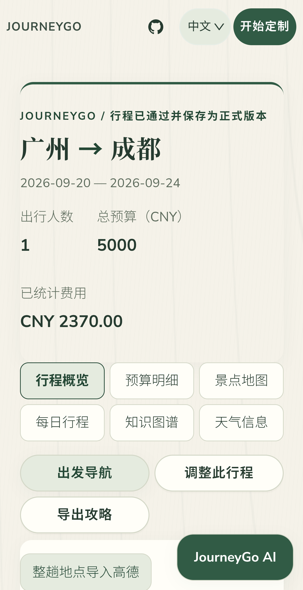
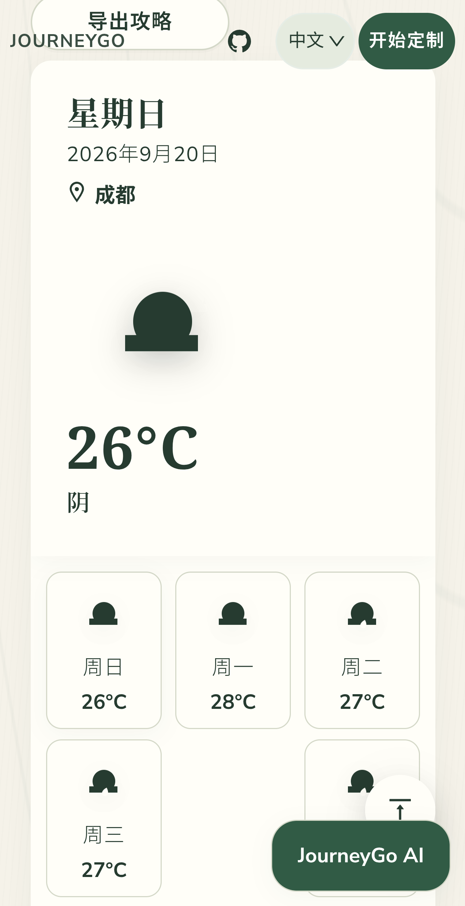
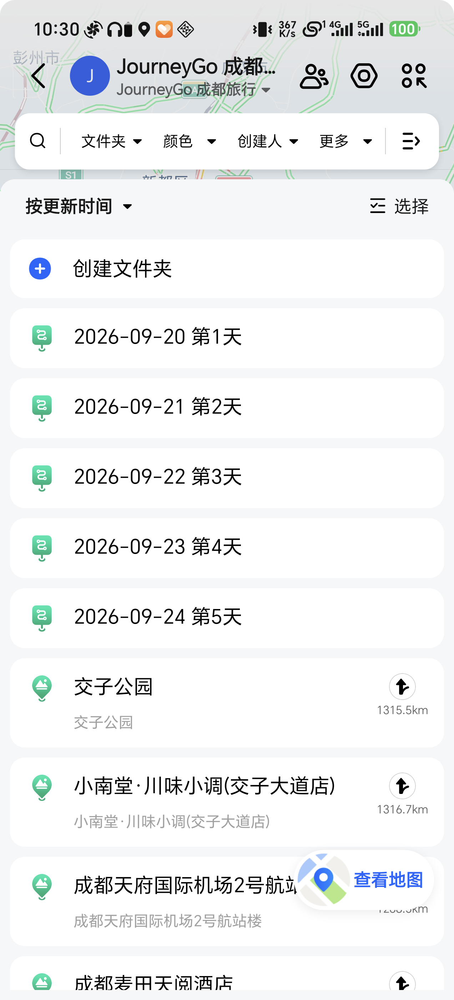
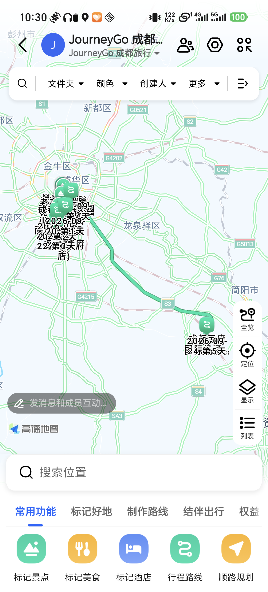
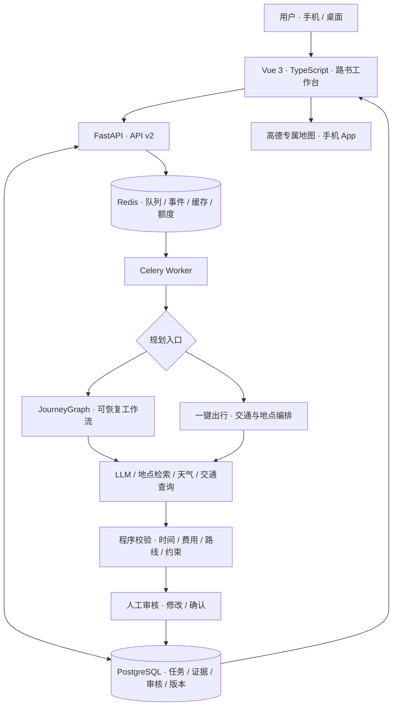
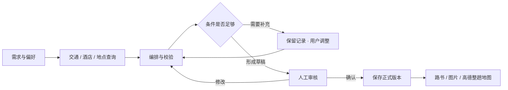

<div align="center">


# JourneyGo · AI 旅行规划助手

**从一句「想去旅行」，到一份能查看、能调整、能带进高德的路书。**

让出发更简单，让每一天都有清晰的安排。

[](https://github.com/Xcaesar1/JourneyGo/actions/workflows/ci.yml)
[](LICENSE)
[](frontend/package.json)
[](backend/requirements.txt)
[](https://github.com/Xcaesar1/JourneyGo/stargazers)

[项目简介](#项目简介) · [核心亮点](#核心亮点) · [实际运行结果](#实际运行结果) · [快速部署](#快速部署与运行指北) · [Star History](#star-history)

</div>

---

## 项目简介

JourneyGo 把**旅行需求、真实交通查询、每日安排与地图出行**串在一起。填写出发地、目的地、日期、预算和偏好，系统会收集地点与交通资料，编排住宿、景点、餐饮和接驳，生成可审核、可修改、可保存的旅行计划。

它不止输出一段攻略文字。你可以查看每天的时间安排、区分已知费用与估算费用、按日期查看天气，也可以把整趟景点、餐厅、酒店和交通枢纽导入一张高德专属地图，在手机中继续使用。

工程上采用 Vue 3 + FastAPI + PostgreSQL + Redis + Celery，结合 JourneyGraph 工作流、来源记录、程序校验和人工确认，让耗时规划可以跟踪进度、暂停补充条件并恢复。

> 无 Key Demo 可体验规划与审核流程；真实交通、天气和地图功能需要相应配置。项目提供查询与规划，不执行车票、机票、酒店或用车预订。

## 核心亮点

| 亮点 | 带来的体验 |
| --- | --- |
| **整趟行程导入高德** | 整理景点、餐厅、酒店与车站/机场，按日期生成专属地图，不再逐个搜索收藏。 |
| **高铁与飞机出行规划** | 接入交通查询，结合抵达、返程时间编排多日行程；报价与来源保留在任务记录中。 |
| **公交优先，驾车路线兜底** | 已接入高德证据的代表景点及远距离机场接驳，优先考虑公交；远距离或公交不可用时比较驾车方案。 |
| **费用看得明白** | 分开统计已知费用、估算和未评估部分，不把未知费用当作零元。 |
| **行程可以继续改** | 草稿先确认，再保存正式版本；支持修改条件、局部重规划与版本记录。 |
| **任务中断后可恢复** | 长任务由 Worker 执行，状态与检查点持久化，缺资料时暂停并提示补充。 |
| **手机优先的路书体验** | 概览、每日安排、预算、地图、交通住宿与天气分区展示，支持图片导出。 |
| **多语言适配** | 当前界面提供中英文切换，保留日文、韩文资源；天气描述跟随当前语言。 |

## 实际运行结果

以下来自 **2026-09-19 第三轮 Android 真机验证**，使用新城市、新任务与真实查询，不是 UI 效果图。当前优先展示成都最终保存版本。

### 广州 → 成都：五天四晚飞机行程

2026-09-20 至 2026-09-24，往返航班 **JD5161 / ZH9442**，住宿 **成都麦田天阅酒店**。已统计费用 **2370 元**，其中已知费用 750 元、估算费用 1620 元；驾车日市内交通费用未评估，不是整趟全包价。

<table>
  <tr><th>正式行程概览</th><th>返程机场接驳</th><th>中文天气预报</th></tr>
  <tr>
    <td></td>
    <td></td>
    <td></td>
  </tr>
</table>

机场往返使用高德驾车路线证据，分别预留 80 分钟和 79 分钟。返程为 03:21 从酒店出发、04:40 到机场，为 06:40 航班预留两小时；车辆需自行安排。

本次结果是在修复机场接驳并人工排除不合适的夜景与重复子地点后完成，原航班报价保留，不表述为无人干预一次成功。

### 核心演示：把五天地点带进高德

成都最终行程生成 **1 张整趟专属地图，覆盖 5 天、19 条每日地点记录**，已在手机高德 App 中打开验证。地点跨日复用会重复计数，不等于 19 个不同地点。

<table>
  <tr><th>JourneyGo 导入入口</th><th>高德按日期分组</th><th>整趟地点全览</th></tr>
  <tr>
    <td></td>
    <td></td>
    <td></td>
  </tr>
</table>

导入的是地点与每日分组，不是公交班次或预订。高德默认连线、排序与驾车展示不代表原路书的全部交通安排。

### 高铁补充验证与可复现记录

| 路线 | 真实验证结果 | 当前边界 |
| --- | --- | --- |
| 广州 → 成都 · 飞机 | 五天四晚正式行程、机场往返接驳、中文天气、5 天 19 条地图记录 | 经人工筛选修订；驾车费用未评估。 |
| 上海 → 杭州 · 高铁 | 五天四晚保存、D2287 / G7526、5 天 25 条地图记录 | 发现灯光秀排在上午及地点体验重叠，作为流程验证，不作为优秀行程样板。 |

[本轮完整记录与 22 张截图](docs/demo/mobile-e2e/20260919-r3/README.md) · [历史武汉 / 丽江验证](docs/demo/mobile-e2e/20260919-r2/README.md)

另有 36 个固定离线场景用于回归：JourneyGraph 通过 35/36。该评测使用 Fixture，不能替代真实供应商可用性或价格验证，详见 [评测报告](docs/EVALUATION_REPORT.md)。

## 系统架构

前端负责需求输入与路书展示，API 负责请求校验和状态查询，Worker 执行耗时规划。PostgreSQL 保存任务、查询记录、审核与版本；Redis 提供队列、进度事件、缓存和累计调用计数。



| 层级 | 技术与职责 |
| --- | --- |
| 交互层 | Vue 3、TypeScript、Vite、Vue I18n、地图与 ECharts 可视化。 |
| 服务层 | FastAPI、Pydantic v2、结构化接口与权限/额度约束。 |
| 任务层 | Celery、LangGraph、可恢复节点、人工审核与重规划。 |
| 数据层 | PostgreSQL 16、SQLAlchemy 2、Alembic、Redis 7。 |
| 外部能力 | 高德、Open-Meteo、12306 MCP、RollingGo、飞常准，以及可选研究来源。 |
| 运行层 | Docker 多阶段构建、Compose、多服务健康检查与隔离部署。 |

详细职责与故障边界见 [架构文档](docs/ARCHITECTURE.md)。

## 核心功能与工作流

### 1. 输入需求，筛选可行地点

填写城市、日期、人数、预算和交通偏好；候选景点按兴趣与实际可行性筛选。必去、偏好与排除地点分别处理，不要求把所有候选点硬塞进日程。

### 2. 查询真实资料，保留来源

按已启用能力查询往返交通、酒店、POI 与天气。交通结果保留时间与来源，付费航班查询受授权和累计额度约束；调整游览安排不应无故重复查询原航班。

### 3. 编排行程，校验时间与费用

按到达、离开时间安排每日游览，并检查通勤、用餐和时间轴。代表景点与远距离机场接驳可采用高德路线；其他部分短途仍可能使用估算。资料不足时暂停补充，不伪造可用路线。

### 4. 审核修改，保存正式版本

先查看草稿，再确认保存。后端保留版本与差异、提供回滚接口，回滚创建新版本，不覆盖历史事实；当前简化路书页不展示完整版本管理面板。长任务进度通过事件流与状态查询呈现，页面刷新后可重新连接。

### 5. 带着路书出发

按天查看景点、餐饮、交通、住宿与天气，导出路书图片；经用户确认，把整趟地点发送给高德并在手机打开。地图创建不等同于预订或车辆预约。



## 快速部署与运行指北

### 方式一：无 Key Demo

准备 Docker Desktop 或 Docker Engine，以及支持 `!override` 的 **Docker Compose v2**。本次配置解析使用 Compose 2.34.0。在仓库根目录执行：

```bash
git clone https://github.com/Xcaesar1/JourneyGo.git
cd JourneyGo
cp .env.demo.example .env.demo
docker compose --env-file .env.demo -f docker-compose.yaml -f docker-compose.demo.yaml config --quiet
docker compose --env-file .env.demo -f docker-compose.yaml -f docker-compose.demo.yaml up --build -d
```

Windows PowerShell 可将 `cp` 换为 `Copy-Item`。打开 **http://127.0.0.1:17862**，体验确定性演示数据、持久任务、校验与人工审核。

```bash
curl http://127.0.0.1:17862/health/live
curl http://127.0.0.1:17862/health/ready
docker compose --env-file .env.demo -f docker-compose.yaml -f docker-compose.demo.yaml down
```

Demo 不调用真实模型、交通或地图服务，也不代表供应商实时结果。停止时不要添加 `-v`，以免删除已保存数据。

### 方式二：配置真实服务

**需要哪些 Key、从哪里配置、怎样填写占位示例：见 [API Key 配置指南](docs/API_KEYS.md)。** Demo 无需 Key；真实出行按模型、高德、酒店、航班等功能分别配置。

复制 `.env.staging.example` 为 `.env.staging`，填写自己的配置后使用隔离 staging 栈。服务默认仅监听本机 `17861` 端口，公网访问应配合 HTTPS 与访问保护。

| 配置 | 用途 |
| --- | --- |
| `POSTGRES_USER` / `POSTGRES_DB` / `POSTGRES_PASSWORD` | 持久数据库；密码使用独立随机值。 |
| `LLM_API_KEY` / `LLM_BASE_URL` / `LLM_MODEL_ID` | 兼容接口的模型服务。 |
| `PLANNER_ENGINE=journey_graph` | 启用可恢复图工作流。 |
| `VITE_AMAP_WEB_KEY` | 高德 Web 服务查询。 |
| `VITE_AMAP_WEB_JS_KEY` / `VITE_AMAP_SECURITY_JS_CODE` | 浏览器地图显示；与 Web 服务 Key 类型不同。 |
| `ONE_CLICK_TRAVEL_ENABLED` / `TRAVEL_TRAIN_ENABLED` / `TRAVEL_HOTEL_ENABLED` | 按需启用一键出行、火车和酒店查询；酒店还需 `ROLLINGGO_API_KEY`。 |
| `WEATHER_ENABLED` | 启用 Open-Meteo 天气能力，使用前核对服务使用范围。 |
| `TRAVEL_FLIGHT_ENABLED` / `VARIFLIGHT_API_KEY` / `TRAVEL_FLIGHT_CALL_LIMIT` | 付费航班查询与累计次数上限；默认关闭，按预算明确设置。 |
| `API_ACCESS_CODE_REQUIRED` / `API_ACCESS_CODE` | 接口访问保护；付费航班要求配置访问码。 |
| `AMAP_PERSONAL_MAP_ENABLED` | 经授权启用整趟专属地图创建。 |

```bash
cp .env.staging.example .env.staging
# 编辑 .env.staging，填入数据库密码及需要的服务配置。
docker compose --env-file .env.staging -f docker-compose.yaml -f docker-compose.staging.yaml config --quiet
docker compose --env-file .env.staging -f docker-compose.yaml -f docker-compose.staging.yaml up --build -d
```

这是**全新安装**命令。已有环境必须先阅读 [命名升级说明](docs/BRANDING_MIGRATION.md)，不能直接切换数据卷、队列和付费计数命名。密钥只放未跟踪环境文件，不提交仓库。

详见 [部署与访问保护](docs/DEPLOYMENT.md)、[交通 MCP 配置](docs/TRAVEL_MCP.md)、[天气配置](docs/WEATHER.md)、[高德地图启用](docs/AMAP_ENABLEMENT_HANDOFF.md)。

### 本地开发与回归

后端采用 Python 3.10+，前端按 CI 使用 Node.js 20。真实任务仍依赖 PostgreSQL、Redis 与 Worker，不是只启动一个 HTTP 进程即可运行。

```bash
uv venv .venv --python 3.10
uv pip install --python .venv -r backend/requirements-dev.txt
npm --prefix frontend ci
```

激活虚拟环境后，在根目录加载开发环境变量，设置 `DATABASE_URL`、`REDIS_URL`、`CELERY_BROKER_URL`，再初始化并分别启动 API 与 Worker：

```bash
python -m alembic -c backend/alembic.ini upgrade head
python -m backend.scripts.setup_langgraph_checkpoints
python -m uvicorn backend.app.api.main:app --host 127.0.0.1 --port 8000 --reload
# 在另一个终端启动 Worker；Windows 建议使用 Docker / WSL 运行 Worker。
celery -A backend.app.workers.celery_app:celery_app worker --loglevel=INFO
# 新终端启动前端，frontend/.env 参考 frontend/.env.example。
npm --prefix frontend run dev
```

不需要真实供应商即可运行的基础检查：

```bash
python -m pytest
npm --prefix frontend test
npm --prefix frontend run build
python -m backend.scripts.run_evaluation --minimum-pass-rate 0.75 --output artifacts/evaluation-report.json
```

未配置测试 PostgreSQL / Redis 时，相关基础设施集成测试会跳过；完整 CI 配置见 [工作流](.github/workflows/ci.yml)。

## 目录结构与关键代码导读

```text
JourneyGo/
├── backend/
│   ├── app/
│   │   ├── api/v2/               # 任务、行程、交通与景点接口
│   │   ├── agents/journey_graph/ # 可恢复规划图与节点
│   │   ├── workers/              # Celery 执行、重试和恢复
│   │   ├── domain/               # 类型契约与校验规则
│   │   ├── services/             # 查询、编排、地图与天气
│   │   └── db/                   # 模型、迁移与会话
│   ├── evaluation/              # 固定回归数据与观测样本
│   ├── scripts/                 # 初始化、评测与 MCP 桥接
│   └── tests/                   # 后端测试
├── frontend/
│   └── src/
│       ├── views/               # 首页、结果页与历史行程
│       ├── components/          # 交互与展示组件
│       ├── services/            # API、恢复、费用与导航
│       └── i18n/                # 四语言资源
├── deploy/                      # 反向代理及部署示例
├── docs/                        # 架构、运维与实测留存
│   └── demo/mobile-e2e/         # 真机截图与验证报告
├── tests/                       # 浏览器场景回归脚本
├── Dockerfile                   # 前后端多阶段镜像
├── docker-compose.yaml          # 数据库、队列、API 与 Worker
└── README.md
```

| 想了解什么 | 从这里开始 |
| --- | --- |
| 任务创建与恢复 | [任务接口](backend/app/api/v2/tasks.py) · [Worker](backend/app/workers/trip_tasks.py) |
| 规划图与人工审核 | [JourneyGraph](backend/app/agents/journey_graph/graph.py) |
| 一键出行与机场接驳 | [OneClickPlanner](backend/app/services/one_click_travel.py) |
| 交通查询、缓存与额度 | [交通服务](backend/app/services/travel_search.py) · [查询记录](backend/app/services/travel_ledger.py) |
| 整趟高德地图 | [专属地图服务](backend/app/services/personal_map.py) |
| 手机路书与天气翻译 | [结果页](frontend/src/views/Result.vue) · [天气文案](frontend/src/services/weatherText.ts) |
| 回归数据与评测入口 | [数据集](backend/evaluation/datasets/journeygo_v1.json) · [评测脚本](backend/scripts/run_evaluation.py) |

[API 文档](docs/API_V2.md) · [备份与恢复](docs/BACKUP_RESTORE_ROLLBACK.md) · [安全边界](docs/SECURITY.md) · [更新记录](docs/CHANGELOG.md)

## Star History

[](https://star-history.com/#Xcaesar1/JourneyGo&Date)

---

Licensed under [GPL-2.0](LICENSE).
