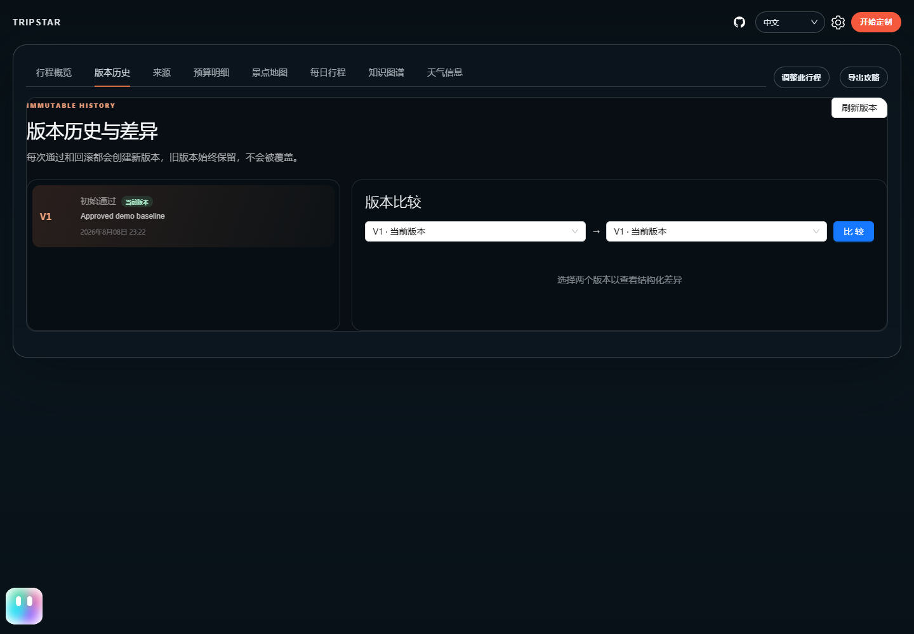
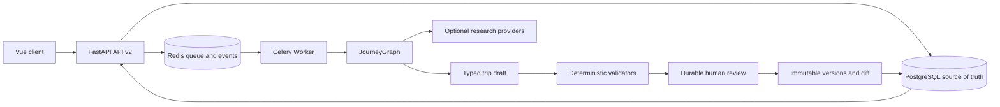

# JourneyGo

<p align="center">
  
</p>

可持续运行、有来源、可校验、可恢复并支持局部重规划的旅行执行 Agent。

[架构](docs/ARCHITECTURE.md) | [API v2](docs/API_V2.md) | [部署](docs/DEPLOYMENT.md) | [评测报告](docs/EVALUATION_REPORT.md)

## 一分钟了解

JourneyGo 将上游 [1sdv/TripStar](https://github.com/1sdv/TripStar) 的一次性旅行攻略生成器，渐进改造成持久任务系统：FastAPI 接收请求，PostgreSQL 保存事实状态，Celery Worker 执行可恢复 JourneyGraph，Redis 负责队列与事件，Vue 展示真实节点进度、交通、费用、天气和人工审核。

它重点证明以下工程能力：

- 长任务不依赖 API 进程内存，API 或 Worker 重启后仍能查询和恢复。
- LLM 生成结构化草案，日期、时间轴、路线、预算、营业时间和强度由程序校验。
- 初版和局部重规划都必须人工确认；历史版本不可变，回滚会创建新版本。
- 外部搜索、地图和社区来源均可失败，失败时使用结构化错误、降级和诊断 ID。
- 服务端 API Key、Cookie 和模型凭据不会发送到浏览器或写入日志。

## 无 Key 演示

只需要 Docker Desktop 或 Docker Engine + Compose v2，不需要模型、地图或社区数据 Key。

```powershell
Copy-Item .env.demo.example .env.demo
docker compose --env-file .env.demo -f docker-compose.yaml -f docker-compose.demo.yaml up --build -d
```

打开 `http://127.0.0.1:17862`。Demo 模式使用确定性结构化数据，仍会经过 JourneyGraph、持久任务、确定性校验和人工审核流程，但不会调用外部模型、搜索、地图 Web Service 或小红书。

```powershell
curl.exe http://127.0.0.1:17862/health/live
curl.exe http://127.0.0.1:17862/health/ready
docker compose --env-file .env.demo -f docker-compose.yaml -f docker-compose.demo.yaml down
```

真实 Provider 配置、staging 隔离、HTTPS、备份和恢复见 [部署手册](docs/DEPLOYMENT.md)。

## 演示截图

| 完整约束表单 | 真实节点进度 |
| --- | --- |
|  |  |
| 人工确认边界 | 不可变版本历史 |
|  |  |

以上为阶段 8 的历史演示截图，使用确定性脱敏 Fixture，不代表当前山野手册界面；Oracle 独立 Demo 栈另行完成真实 API、Worker、JourneyGraph、审批和持久化验收。

## 真机实测：高铁与飞机五天行程

最新一轮使用新城市、新任务在真实 Android 手机上验证：上海到杭州高铁，以及广州到成都飞机，均为五天四晚。成都在补齐机场接驳、人工排除不合适的夜景与重复子地点后完成并保存，往返 JD5161 / ZH9442，已统计费用 2370 元；机场往返提供高德驾车路线，驾车日交通费另计。不是无人干预一次成功，也不是全包价，未发生预订。

<p>
  
  
  
</p>

杭州高铁流程与新版界面通过，但人工发现灯光秀被排在上午等质量问题，不包装成优秀整趟案例。以 [第三轮新城市实测](docs/demo/mobile-e2e/20260919-r3/README.md) 为当前依据；[第二轮武汉、丽江记录](docs/demo/mobile-e2e/20260919-r2/README.md) 保留为历史。

## 产品亮点：整趟地点带进高德

不止生成攻略或逐个跳转地点：将景点、餐厅、酒店和车站整合进一张高德专属地图，按旅行日期组织，直接在手机高德 App 中查看。本轮成都、杭州各创建一次，分别为 5 天19条、5天25条每日地点记录，均无坐标缺失遗漏；以下优先展示成都最终结果。

<p>
  
  
  
</p>

这里导入的是地点与每日分组，不是公交班次、门票或预订；高德显示的默认驾车路线不等于原攻略交通安排。酒店等跨日地点会重复计数。详见 [本轮整趟导入演示与边界](docs/demo/mobile-e2e/20260919-r3/README.md)。

## 核心流程



完整 Before/After 图和故障边界见 [架构文档](docs/ARCHITECTURE.md)。

## 可复现评测

固定数据集 `journeyops-travel-v1.0.0` 包含 36 个正常与故障场景，覆盖结构、预算、时间、来源、重试、恢复、局部重规划、注入防护、并发和模型预算。

| Engine | 通过 | 通过率 | 脱敏延迟样本 | 脱敏费用样本 |
| --- | ---: | ---: | ---: | ---: |
| legacy | 28 / 36 | 77.78% | 120,000 ms | USD 6.84 |
| journey_graph | 35 / 36 | 97.22% | 91,000 ms | USD 5.04 |

这些延迟和费用是固定脱敏 Fixture，不代表当前供应商实时性能或价格。失败案例和指标定义完整保留在 [评测报告](docs/EVALUATION_REPORT.md)。

```powershell
.\.venv\Scripts\python.exe -m backend.scripts.run_evaluation --dataset backend/evaluation/datasets/journeyops_v1.json --observations backend/evaluation/fixtures/offline_observations_v1.json --minimum-pass-rate 0.75 --output artifacts/evaluation-report.json
```

## 技术栈

Python 3.10、FastAPI、Pydantic v2、SQLAlchemy 2、Alembic、PostgreSQL 16、Redis 7、Celery、LangGraph、Vue 3、TypeScript、Vite、Docker Compose。

## 项目文档

- [历史阶段 8 验收](docs/PHASE_8_ACCEPTANCE.md)
- [API v2](docs/API_V2.md)
- [火车、酒店与航班 MCP 查询](docs/TRAVEL_MCP.md)
- [架构与故障策略](docs/ARCHITECTURE.md)
- [部署与 staging](docs/DEPLOYMENT.md)
- [备份、恢复与回滚](docs/BACKUP_RESTORE_ROLLBACK.md)
- [安全边界](docs/SECURITY.md)
- [3–5 分钟演示脚本](docs/DEMO_SCRIPT.md)
- [相对上游改动](docs/CHANGELOG_FROM_UPSTREAM.md)

## 上游与许可证

本项目基于 [1sdv/TripStar](https://github.com/1sdv/TripStar) 深度二次开发，保留其 GPL-2.0 许可证和上游归因。JourneyGo 的持久任务、JourneyGraph、来源证据、确定性校验、人工审核、版本化、评测、可观测性、安全与部署改造见 [相对上游改动](docs/CHANGELOG_FROM_UPSTREAM.md)。

历史文档中的 JourneyOps 是本项目的早期代号；现有部署路径、镜像、容器和存储标识为保持兼容仍可能沿用该名称，不应仅为改名而修改。

Licensed under [GPL-2.0](LICENSE).
