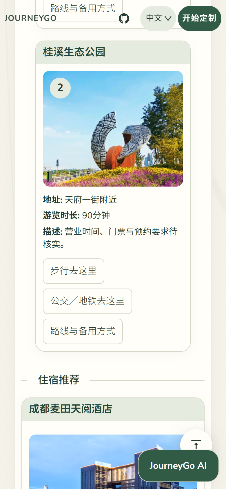
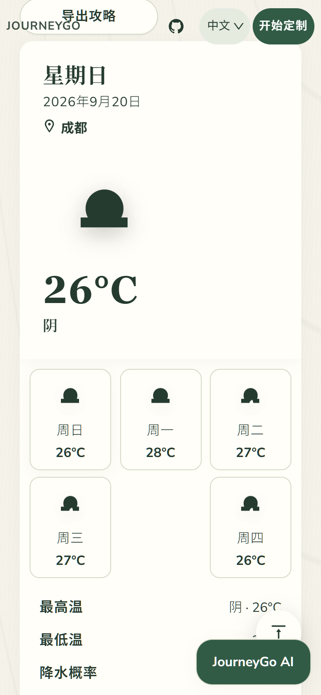
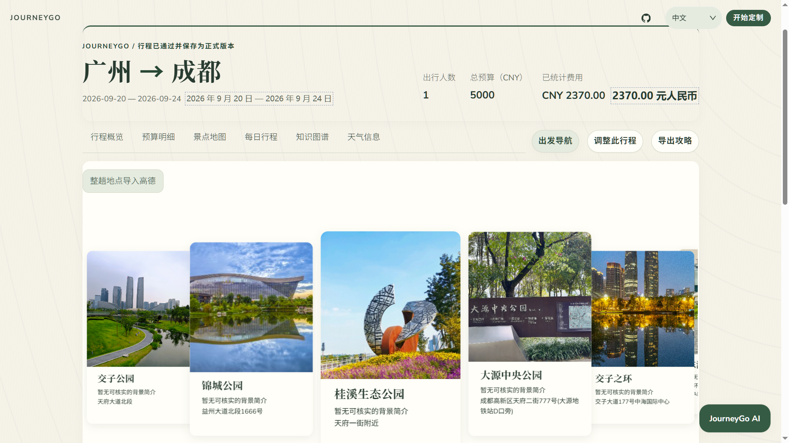
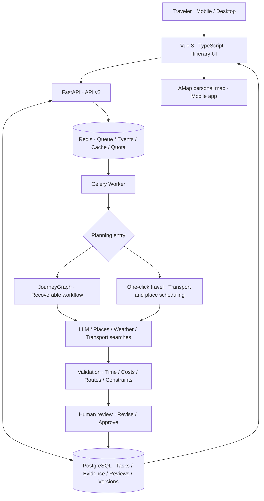
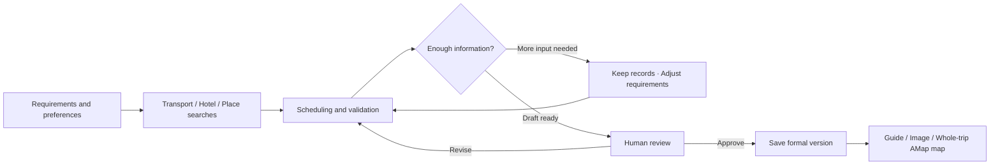

<div align="center">

[中文](README.md) | [English](README_en.md)


# JourneyGo · AI Travel Planner

**From "let's take a trip" to an itinerary you can review, refine, and open in AMap.**

Make departure simpler. Give every day a clear plan.

[](LICENSE)
[](backend/requirements.txt)
[](backend/requirements.txt)
[](backend/app/agents/journey_graph/graph.py)
[](backend/app/workers/celery_app.py)
[](docker-compose.yaml)
[](docker-compose.yaml)

[](frontend/package.json)
[](frontend/package.json)
[](frontend/package.json)
[](backend/app/db/models.py)
[](Dockerfile)

[Overview](#overview) · [Highlights](#highlights) · [Real Results](#real-results) · [Quick Start](#quick-start) · [Star History](#star-history)

</div>

---

## Overview

JourneyGo connects **travel preferences, real transport searches, daily schedules, and map-based exploration**. Enter your origin, destination, dates, budget, and interests to build a plan covering accommodation, attractions, meals, and transfers. Review it, make changes, and save the final version.

Instead of stopping at a block of generated text, JourneyGo lets you inspect the daily timeline, distinguish known costs from estimates, check date-specific weather, and send the entire trip's attractions, restaurants, hotels, and transport hubs to a personal AMap map.

The application uses Vue 3, FastAPI, PostgreSQL, Redis, and Celery, with LangGraph-based JourneyGraph workflows, source records, programmatic validation, and human approval. Long-running planning tasks expose progress, pause for missing information, and support recovery.

> The keyless Demo covers planning and approval. Live transport, weather, and map features require their respective configuration. JourneyGo searches and plans; it does not book tickets, flights, hotels, or vehicles.

## Highlights

| Feature | What it provides |
| --- | --- |
| **Whole-trip AMap export** | Collect attractions, restaurants, hotels, stations, and airports into a personal map grouped by date. |
| **Rail and flight planning** | Use transport search results and arrival/departure times to build multi-day itineraries while retaining quotes and sources. |
| **Transit first, driving fallback** | Evidence-backed landmark and long-distance airport transfers prioritize transit and compare driving when distances are long or transit is unavailable. |
| **Transparent costs** | Separate known costs, estimates, and unassessed expenses rather than treating unknown costs as zero. |
| **Editable itineraries** | Review drafts before saving, revise requirements, replan scoped portions, and retain version records. |
| **Recoverable tasks** | Workers execute long tasks with persistent state and checkpoints; missing information triggers a pause rather than invented results. |
| **Mobile-friendly travel guide** | Dedicated overview, daily schedule, budget, map, transport, accommodation, and weather sections, plus image export. |
| **Language-aware UI** | The current UI offers Chinese and English; Japanese and Korean resources are retained. Weather descriptions follow the selected language. |

## Real Results

These examples use the Chengdu itinerary saved during the **September 19, 2026 verification round**, with real search results rather than fictional mockups. The overview and AMap screenshots came from an Android device. Daily-attraction and weather images were captured from the same saved result in a mobile-sized desktop browser. The wide desktop screenshot was supplied by the project owner; screenshot UI text is Chinese.

### Guangzhou to Chengdu: Five Days, Four Nights

September 20-24, 2026, with flights **JD5161 / ZH9442** and accommodation at **Chengdu Maitian Tianyue Hotel**. The counted total is **CNY 2,370**: CNY 750 in known costs and CNY 1,620 in estimates. Local transport on driving days is unassessed; this is not an all-inclusive trip price.

<table>
  <tr><th>Saved itinerary</th><th>Daily attraction photos</th><th>Localized weather</th></tr>
  <tr>
    <td></td>
    <td></td>
    <td></td>
  </tr>
</table>

Airport transfers use AMap driving-route evidence, allowing 80 and 79 minutes respectively. The return departs the hotel at 03:21, reaches the airport at 04:40, and leaves two hours before the 06:40 flight. Travelers must arrange their own vehicle.

This result was completed after correcting airport-transfer handling and manually excluding unsuitable night-view stops and duplicate sublocations. Original flight quotes were retained; this was not a fully unattended first-pass success.

### Desktop: Whole-Trip Attraction Overview

<p align="center">
  
</p>

### Bringing All Five Days into AMap

The final Chengdu itinerary produced **one personal map with five date groups and 19 daily place records**, opened and verified in the mobile AMap app. Places reused across days are counted more than once; this does not mean 19 unique locations.

<table>
  <tr><th>JourneyGo export entry</th><th>AMap date groups</th><th>Whole-trip map</th></tr>
  <tr>
    <td></td>
    <td></td>
    <td></td>
  </tr>
</table>

The export contains places and daily groups, not transit departures or bookings. AMap's default lines, ordering, and driving display do not reproduce every transport decision in the itinerary.

## System Architecture

The frontend handles requirements and itinerary presentation. The API validates requests and serves task state. Workers execute long-running planning. PostgreSQL stores tasks, query records, reviews, and versions; Redis supplies queues, progress events, caches, and cumulative call counters.



| Layer | Technologies and responsibilities |
| --- | --- |
| UI | Vue 3, TypeScript, Vite, Vue I18n, maps, and ECharts visualization. |
| API | FastAPI, Pydantic v2, structured contracts, access controls, and quota checks. |
| Tasks | Celery, LangGraph, recoverable nodes, human review, and replanning. |
| Data | PostgreSQL 16, SQLAlchemy 2, Alembic, and Redis 7. |
| Providers | AMap, Open-Meteo, 12306 MCP, RollingGo, Variflight, and optional research sources. |
| Deployment | Multi-stage Docker builds, Compose, service health checks, and isolated environments. |

See the [architecture guide](docs/ARCHITECTURE.md) for component responsibilities and failure boundaries.

## Features and Workflow

### 1. Define Preferences and Select Feasible Places

Specify cities, dates, travelers, budget, and transport preferences. Candidate attractions are filtered by interest and feasibility. Required, preferred, and excluded places are handled separately; selecting every candidate is not necessary.

### 2. Search Real Sources and Keep Records

Enabled providers supply round-trip transport, hotels, POIs, and weather. Transport records retain timestamps and sources. Paid flight searches require consent and obey a cumulative call limit; adjusting sightseeing should not unnecessarily refresh existing flights.

### 3. Schedule and Validate

Arrival and departure times bound the daily plan, with checks for transfers, meals, and timeline consistency. Landmarks and long-distance airport transfers can use AMap route evidence; some shorter transfers still use estimates. Missing evidence pauses planning rather than producing fabricated routes.

### 4. Review, Revise, and Save

Review the draft before approval. The backend preserves versions and diffs and provides rollback APIs that create a new version rather than overwrite history. The simplified itinerary page does not expose the full version-management panel. Event streams and status requests let the client reconnect after a page refresh.

### 5. Use the Guide on the Trip

Browse daily attractions, meals, transfers, hotels, and weather, or export the guide as an image. With user confirmation, send the entire trip's places to AMap and open them on a phone. Creating a map is not a booking or vehicle reservation.



## Quick Start

### Option 1: Keyless Demo

Install Docker Desktop or Docker Engine and **Docker Compose v2 with `!override` support**. Configuration parsing was verified with Compose 2.34.0. Run from the repository root:

```bash
git clone https://github.com/Xcaesar1/JourneyGo.git
cd JourneyGo
cp .env.demo.example .env.demo
docker compose --env-file .env.demo -f docker-compose.yaml -f docker-compose.demo.yaml config --quiet
docker compose --env-file .env.demo -f docker-compose.yaml -f docker-compose.demo.yaml up --build -d
```

In Windows PowerShell, `Copy-Item` can replace `cp`. Open **http://127.0.0.1:17862** to explore deterministic demo data, persistent tasks, validation, and human review.

```bash
curl http://127.0.0.1:17862/health/live
curl http://127.0.0.1:17862/health/ready
docker compose --env-file .env.demo -f docker-compose.yaml -f docker-compose.demo.yaml down
```

Demo does not call live models, transport providers, or map services. Do not append `-v` when stopping it unless you intend to delete saved data.

### Option 2: Live Providers

The [API key guide](docs/API_KEYS.md) contains feature-specific requirements and placeholder examples in Chinese. Copy `.env.staging.example` to `.env.staging` and fill in your own values. The isolated staging stack binds to localhost port `17861`; use HTTPS and access protection before exposing it publicly.

| Configuration | Purpose |
| --- | --- |
| `POSTGRES_USER` / `POSTGRES_DB` / `POSTGRES_PASSWORD` | Persistent database; use a separate random password. |
| `LLM_API_KEY` / `LLM_BASE_URL` / `LLM_MODEL_ID` | Credentials, endpoint, and model from the same compatible provider. |
| `PLANNER_ENGINE=journey_graph` | Enable the recoverable graph workflow. |
| `VITE_AMAP_WEB_KEY` | Server-side AMap Web Service queries; do not put this key in frontend environment files. |
| `VITE_AMAP_WEB_JS_KEY` / `VITE_AMAP_SECURITY_JS_CODE` | Browser map credentials; restrict allowed domains. |
| `ONE_CLICK_TRAVEL_ENABLED` / `TRAVEL_TRAIN_ENABLED` / `TRAVEL_HOTEL_ENABLED` | Enable one-click travel, rail, and hotels as needed; hotels also require `ROLLINGGO_API_KEY`. |
| `WEATHER_ENABLED` | Enable Open-Meteo weather, subject to applicable usage terms. |
| `TRAVEL_FLIGHT_ENABLED` / `VARIFLIGHT_API_KEY` / `TRAVEL_FLIGHT_CALL_LIMIT` | Enable paid flight searches with an explicitly chosen cumulative call ceiling; disabled by default. |
| `API_ACCESS_CODE_REQUIRED` / `API_ACCESS_CODE` | Protect the API; paid flight searches require a configured access code. |
| `AMAP_PERSONAL_MAP_ENABLED` | Enable authorized creation of whole-trip personal maps. |

```bash
cp .env.staging.example .env.staging
# Edit .env.staging with your database password and required provider settings.
docker compose --env-file .env.staging -f docker-compose.yaml -f docker-compose.staging.yaml config --quiet
docker compose --env-file .env.staging -f docker-compose.yaml -f docker-compose.staging.yaml up --build -d
```

These commands are for a **fresh installation**. Existing deployments must follow the [namespace migration guide](docs/BRANDING_MIGRATION.md) before changing volume names, task names, or paid counters. Keep populated environment files out of Git.

More detail: [deployment](docs/DEPLOYMENT.md), [travel MCP](docs/TRAVEL_MCP.md), [weather](docs/WEATHER.md), and [AMap enablement](docs/AMAP_ENABLEMENT_HANDOFF.md). Some operational documents are in Chinese.

### Local Development and Checks

Use Python 3.10+ and Node.js 20, matching CI. Real task execution also requires PostgreSQL, Redis, and a Worker; starting only the HTTP server is insufficient.

```bash
uv venv .venv --python 3.10
uv pip install --python .venv -r backend/requirements-dev.txt
npm --prefix frontend ci
```

Activate the virtual environment and load your development variables, including `DATABASE_URL`, `REDIS_URL`, and `CELERY_BROKER_URL`. Initialize storage and start the services in separate terminals:

```bash
python -m alembic -c backend/alembic.ini upgrade head
python -m backend.scripts.setup_langgraph_checkpoints
python -m uvicorn backend.app.api.main:app --host 127.0.0.1 --port 8000 --reload
# Separate terminal. Use Docker or WSL for the Worker on Windows.
celery -A backend.app.workers.celery_app:celery_app worker --loglevel=INFO
# Separate terminal; configure frontend/.env using frontend/.env.example.
npm --prefix frontend run dev
```

Local checks that do not require live providers:

```bash
python -m pytest
python -m mypy backend/app/domain backend/app/evaluation backend/app/services/replanning.py backend/app/services/routing
npm --prefix frontend test
npm --prefix frontend run build
node --test tests/readme.test.cjs tests/secrets-config.test.cjs
python -m backend.scripts.run_evaluation --minimum-pass-rate 0.75 --output artifacts/evaluation-report.json
```

Infrastructure integration tests are skipped when test PostgreSQL and Redis are not configured. The complete pipeline is defined in the [CI workflow](.github/workflows/ci.yml).

## Repository and Code Guide

```text
JourneyGo/
|-- backend/
|   |-- app/
|   |   |-- api/v2/               # Tasks, trips, transport, and attractions
|   |   |-- agents/journey_graph/ # Recoverable graph and planning nodes
|   |   |-- workers/              # Celery execution, retries, and recovery
|   |   |-- domain/               # Typed contracts and validation rules
|   |   |-- services/             # Search, scheduling, maps, and weather
|   |   `-- db/                   # Models, migrations, and sessions
|   |-- evaluation/              # Fixed regression data and observations
|   |-- scripts/                 # Setup, evaluation, and MCP bridges
|   `-- tests/                   # Backend tests
|-- frontend/src/
|   |-- views/                   # Home, results, and saved trips
|   |-- components/              # UI components
|   |-- services/                # API, recovery, costs, and navigation
|   `-- i18n/                    # Language resources
|-- deploy/                      # Proxy and deployment examples
|-- docs/                        # Architecture, operations, and evidence
|   `-- demo/mobile-e2e/          # Device screenshots and verification reports
|-- tests/                       # Browser scenarios and documentation checks
|-- Dockerfile                   # Multi-stage frontend/backend image
|-- docker-compose.yaml          # Database, queue, API, and Worker
|-- README.md                    # Chinese guide
`-- README_en.md                 # English guide
```

| Topic | Start here |
| --- | --- |
| Task creation and recovery | [Task API](backend/app/api/v2/tasks.py), [Worker](backend/app/workers/trip_tasks.py) |
| Planning graph and human review | [JourneyGraph](backend/app/agents/journey_graph/graph.py) |
| One-click travel and airport transfers | [OneClickPlanner](backend/app/services/one_click_travel.py) |
| Transport searches, caches, and quotas | [Search service](backend/app/services/travel_search.py), [query ledger](backend/app/services/travel_ledger.py) |
| Whole-trip AMap export | [Personal map service](backend/app/services/personal_map.py) |
| Mobile itinerary and weather localization | [Result view](frontend/src/views/Result.vue), [weather text](frontend/src/services/weatherText.ts) |
| Regression dataset and runner | [Dataset](backend/evaluation/datasets/journeygo_v1.json), [evaluation script](backend/scripts/run_evaluation.py) |

[API reference](docs/API_V2.md) · [Backup and recovery](docs/BACKUP_RESTORE_ROLLBACK.md) · [Security guide](docs/SECURITY_GUIDE.md) · [Changelog](docs/CHANGELOG.md)

## Star History

[](https://star-history.com/#Xcaesar1/JourneyGo&Date)

---

Licensed under [GPL-2.0](LICENSE).
