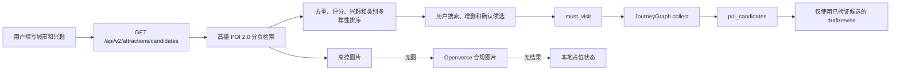

# 景点发现与图片源改造：阶段一验收

验收日期：2026-08-21

## 1. 结论

阶段一通过验收，可以进入默认关闭的阶段二携程候选补充实现。

- 高德 POI 2.0 REST API 是唯一主候选源。
- 用户生成行程前必须查看并选择候选，选择结果写入 `must_visit`。
- JourneyGraph 只保留高德验证候选和显式 `must_visit`，并持久保存 `poi_candidates`。
- 图片链路为高德 `photos.url`、Openverse、前端本地占位状态。
- Openverse 仅接受 CC0、PDM、CC BY 和 CC BY-SA，并返回完整署名元数据。
- 正常规划路径不调用小红书或抖音。
- 本阶段未接入携程、未提升生产环境。

## 2. 数据流

## 3. API 与兼容性

| 接口 | 结果 |
| --- | --- |
| `GET /api/v2/attractions/candidates` | 支持城市、天数、兴趣、必去、排除和最多 40 个候选 |
| `GET /api/poi/photo` | 保留旧响应字段，新增 `poi_id` 优先解析及来源、作者、许可证、来源页和署名 |
| `POST /api/v2/trips` | 前端提交用户选中候选名称到 `must_visit` |

景点结构已包含 `poi_id`、评分、图片 URL、图片来源、作者、许可证、来源页、署名和推荐理由。

## 4. 自动化测试

| 检查 | 结果 |
| --- | --- |
| 后端全量 pytest | `161 passed, 4 skipped` |
| 前端候选选择测试 | `5 passed` |
| 前端生产构建 | 通过 |
| 高德分页、解析、排序、去重、兴趣、必去和排除 | 通过 |
| 高德无图到 Openverse、Openverse 无结果到占位 | 通过 |
| Openverse 许可证与署名 | 通过 |
| 多城市、默认勾选、搜索、增删、失败、无图和移动布局 | 通过 |
| 活跃 XHS/抖音引用扫描 | `0` |

既有非阻断警告：Pydantic v2 迁移提示、Starlette TestClient 提示、旧静态资源构建提示，以及主前端 chunk 大于 500 kB。

## 5. Staging 真实验收

候选接口在北京、西安、杭州均返回 40 个唯一 POI，`degraded=false`；所有候选有 `poi_id` 和坐标，图片允许按三级链路降级。

| 城市 | Trip ID | 用户必去结果 | POI/坐标/图片 |
| --- | --- | --- | --- |
| 北京 | `trip_3e1af17d0ab746fe99d6` | 故宫博物院、天坛公园 | 2/2、2/2、2/2 |
| 西安 | `trip_ad1028f57bde4a248b10` | 秦始皇兵马俑博物馆、西安城墙 | 2/2、2/2、2/2 |
| 杭州 | `trip_def624f0b296444b9503` | 西溪国家湿地公园、杭州西湖风景名胜区 | 2/2、2/2、2/2 |

图片真实测试结果：

- 高德 POI 图片返回 `source=amap` 和有效 URL。
- Openverse 返回有效 URL、作者、许可证、来源页和署名。
- 无匹配结果返回 `source=placeholder`，不下载或镜像第三方图片。

## 6. 隔离与回滚

- Staging API/Worker 使用独立 PostgreSQL、Redis 和应用数据卷。
- Staging 仅监听 Oracle 回环地址 `127.0.0.1:17861`。
- Demo 保持旧镜像和独立数据卷。
- Production 未修改，验收期间 readiness 保持 HTTP 200。
- 阶段一部署前备份：`/var/backups/tripstar/20260821T113228Z-attraction-phase1-predeploy`。
- 阶段一前端补测部署前备份：`/var/backups/tripstar/20260821T142927Z-attraction-frontend-predeploy`。

回滚时恢复部署前 Git bundle 和 `.env.staging`，再用备份中记录的镜像重新创建 staging API/Worker。不得把阶段一 staging 镜像直接提升到生产。

## 7. 阶段二入口条件

- 携程问道必须默认关闭。
- 只有 `TRIPAI_ENABLED=true` 且存在独立 `TRIPAI_API_KEY` 时才允许调用。
- 每城最多调用一次，只提取景点名称。
- 所有携程名称必须再次通过高德验证后才能进入候选。
- 携程失败、限流、格式错误和高德无法验证必须安全降级到纯高德结果。
- 不使用携程图片，不允许携程直接决定路线。
