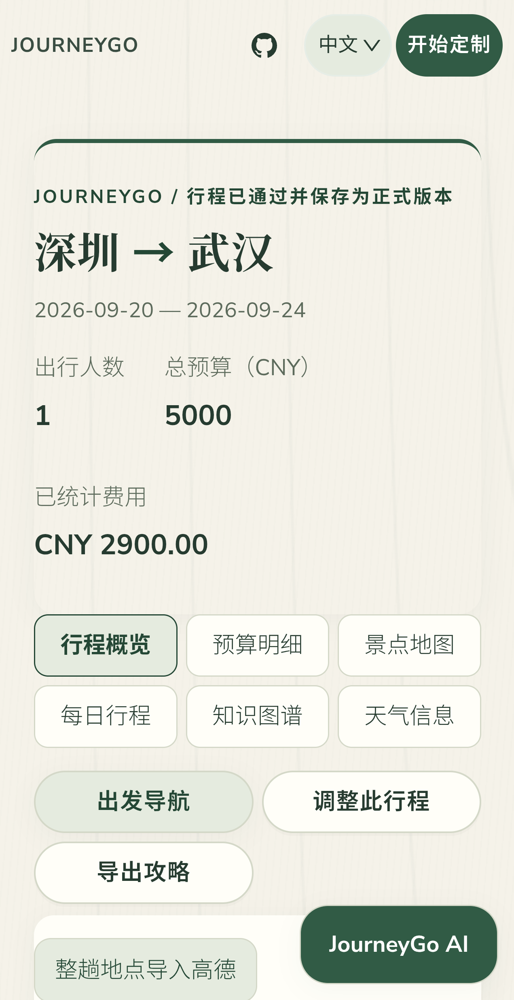
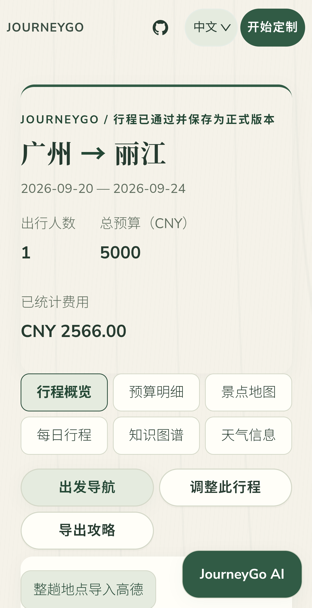
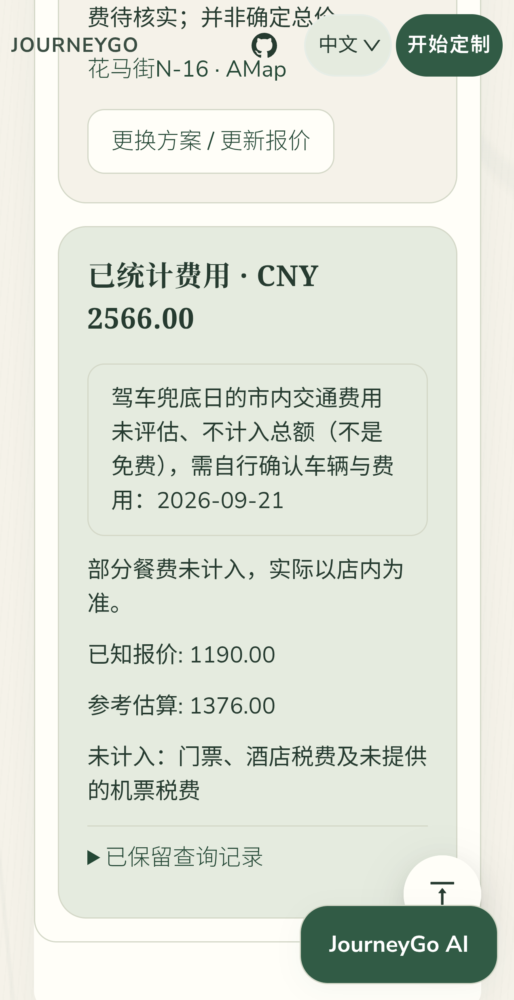

# 第二轮真机实测：高铁与飞机

## 结果

2026-09-19，通过 ADB 转发的真实 Android Chrome 完成表单操作、结果检查、触摸滑动和审核保存。使用 staging 已部署代码 `fbd5a45`，不是 Fixture。两条行程均为 2026-09-20 至 09-24，一人、五天四晚、输入预算 5000 元，最终 completed / 正式 V1。

| 行程 | 本轮方式 | 往返交通 | 已统计费用 | 核心景点 |
| --- | --- | --- | --- | --- |
| 深圳到武汉 | 新建真实任务 | G1040 / G1042，二等座各 640.50 元 | 2900 元 | 黄鹤楼 120 分钟 |
| 广州到丽江 | 恢复既有真实任务，保留航班报价 | ZH8903 450 元 / JD5132 740 元 | 2566 元 | 玉龙雪山 360 分钟 |

- 武汉任务：`task_dd969c78306d402ebd79`。最初相同输入命中旧任务去重，不计为新测试；添加明确复测说明后创建本任务，新增两条高铁查询。
- 丽江任务：`task_0954c6f772aa4cc6b128`。通过手机“按表单继续规划”恢复，原有两条航班报价账本与恢复前深比较一致，没有刷新机票。
- 用户授权的 staging 航班总额度已从 10 调整为 15；本轮结束已用 8、剩余 7，本轮新增付费航班查询 0。没有清零计数。

## 丽江驾车兜底

9 月 21 日酒店到玉龙雪山的高德道路里程 27,515 米，含 30 分钟接驳预留后 74 分钟，比公共交通含预留更快；返程没有可用公交，采用高德道路里程 27,030 米、含预留 68 分钟的驾车方案。

时间轴为 09:00 出发、10:14 至 16:14 游览、16:14 至 17:14 用餐/休息、17:14 至 18:22 返程。没有缩短核心景点游览来凑时间。用餐点和费用仍待核实。

真机检查两段“高德驾车路线”链接均使用已保存的正确起终点，`mode=car`，返程不是从手机当前位置出发。本轮没有实际打开原生高德导航，没有承诺车辆可接单，也没有叫车或预订。

## 真机证据

- 两条路线各检查 6 个结果栏目、5 个每日面板、已加载的地图画布；363 CSS px 视口无横向溢出，未记录页面错误。
- 实际触摸滑动验证景点轮播发生变化；时间线连续，无关键校验错误，无时间断档或用餐时间错误。
- 保留 `daily_commute_high` 和 `opening_hours_unverified` 告警，没有将带告警结果描述成全项无风险。
- 14 张精选原始视口截图及两份白名单脱敏 JSON 留存于本目录。JSON 包含截图 SHA-256、费用状态、查询范围、时间线和 UI 验证结果；原始完整状态仅保留在忽略提交的本地 artifacts 中。

  
  
  

[武汉验证数据](shenzhen-wuhan/verification.json) | [丽江验证数据](guangzhou-lijiang/verification.json)

## 费用与验证边界

- 武汉 2900 元由已知交通报价 1281 元和估算 1619 元组成；丽江 2566 元由保留航班报价 1190 元和估算 1376 元组成。不是全包价，不保证实际整趟费用低于预算。
- 门票、部分税费等未核实费用不在总额内。丽江驾车日整天市内交通未评估，`driving_transfers.amount_cents=null`，不是免费。
- 当前代表景点专日可使用真实高德公交/驾车证据；其他短途接驳仍有基于距离的估算，不能宣称所有路段都已获得高德公交方案。
- 航班使用既有真实报价，未验证本轮时刻的新价格或剩余座位；无机票、酒店、门票或车辆预订。
- 本轮新建高德专属地图 0 张。此前整趟地点导入创新点的独立真机证据仍见 [整趟地图演示](../20260919/amap-export/README.md)，不重复创建。
- 只调整 staging 额度，API/worker 均 healthy；生产与既有数据未变。额度覆盖文件位于 `/opt/tripstar/releases/quota15-20260919/quota.compose.yaml`。
